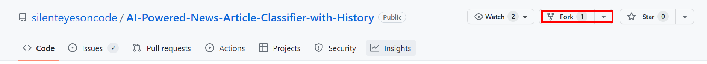
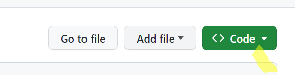
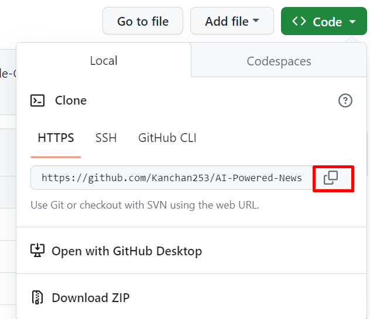

# Contributing to this project:

We appreciate your interest in supporting [AI-Powered-News-Article-Classifier-with-History]! . Your contributions are highly valued and can take various forms. This guide outlines the different ways you can contribute to the project.

# To contribute to this repository:

The following are some ways you can contribute to this project:

## 1.Report Bugs:

If you encounter any bugs or problems while working on the project, kindly let us know. Describe the issue in full, including how to reproduce it and any error messages you run into, in an issue on the project's GitHub repository.

## 2.Request Features:

If you have suggestions for new features or improvements, please share them with us. Declare the feature you want to be included as an issue on the project's GitHub repository. Your suggestions aid us in setting priorities and guiding the project's progress.

## 3.Changes to the Code:

If you're interested in making changes to the project's code, please do so. In order to submit your code changes, follow these steps:

### Step 1: Fork this repository

●Click the "Fork" button at the top right corner of this repository's page.

### Step 2:Clone the forked repository

●Go to your GitHub account and open the forked repository.
●Click the "Code" button and then the copy icon to copy the repository's URL.

●Open a terminal and run the following command:
git clone "url you just copied"

The command will look something like this :
git clone https://github.com/{your github user name}/AI-Powered-News-Article-Classifier-with-History.git

### Step 3:Navigate to the Repository

●Open the terminal and change your directory to the cloned repository.
●If you wish to contribute to the backend, navigate to the backend directory:

cd AI-Powered-News-Article-Classifier-with-History/back-end/

●If you wish to contribute to the frontend, navigate to the frontend directory:

cd AI-Powered-News-Article-Classifier-with-History/front-end/

### Step 4:Add Upstream Link and Keep Your Repo Updated

●Add an upstream link to the main branch in your cloned repo.

git remote add upstream https://github.com/silenteyesoncode/AI-Powered-News-Article-Classifier-with-History

●Keep your cloned repo up to date by pulling from upstream (as this will avoid any merge conflicts while committing new changes)

git pull upstream (main or master)

### Step 5:Create a Feature Branch

●Create a new branch to work on your feature:(This is a necessary step).

git checkout -b <feature-name>

### Step 6: Make and Stage Your Changes

●Make the necessary changes to the code.
●Stage your changes by adding them to the staging area:
git add .

### Step 7: Commit the changes

●Now commit those changes using the git commit command:

git commit -m "Write a commit message"

### Step 8: Push your code.

●Now push your changes to your forked repository on GitHub :
git push -u origin your-branch-name

### Step 9:Create a Pull Request

●Go to the original repository on GitHub.
●Click on the "Pull Requests" tab.
●Click the "New Pull Request" button.
●Write a meaningful pull request message to explain your contribution and why you made the changes.

Note: It's important to provide clear and concise instructions while also using proper formatting to enhance readability.
